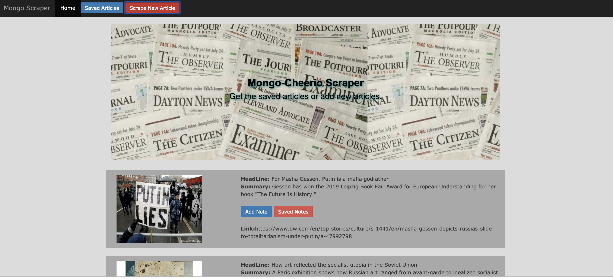
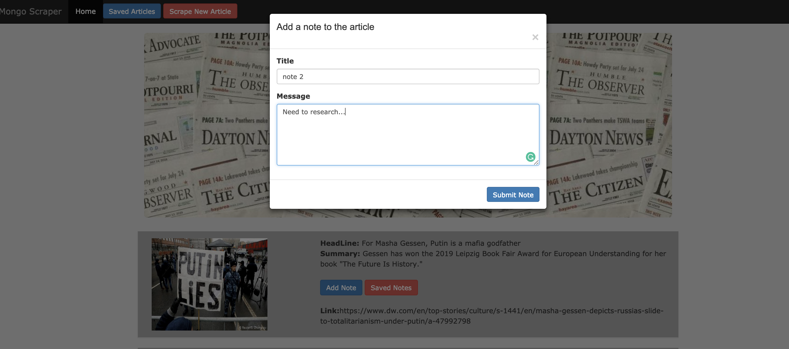
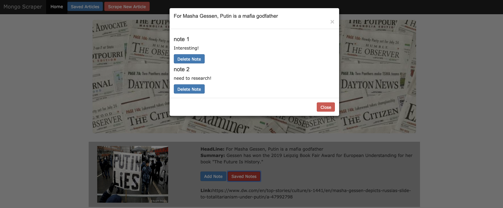

# Mongo-Cheerio
* Mongo Scraper is a web scraping app. User can see either 'Scraped Article' or scrape 'New Article'.

* After the articles being scraped, user can add note to the article. 

* User can view the saved notes and also may delete the note.

* Technology used for this application
   1. express

   2. express-handlebars

   3. mongoose

   4. cheerio

   5. axios
   
   6. Bootstrap
